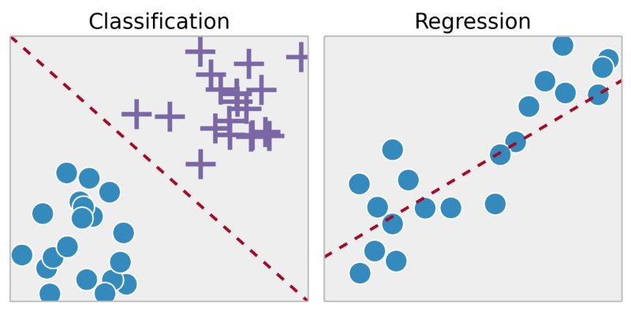

# Machine Learning Models for OHLCV Stock Analysis

This folder contains the trained machine learning models for stock price prediction.
These models are serialized as `.bin` files using Python's `pickle` and can be loaded directly for inference.

## 📂 Models Included

1. **Classification Model**  
`model_xgb_class.bin`

- **Purpose:** Predicts the probability of stock price moving up or down.
- **Algorithm:** XGBoost classifier (binary classification).
- **Preprocessing:** Uses a DictVectorizer (`dv_class`) to transform OHLCV features.
- **Output:** Class probability (0-1) and binary label (0=down, 1=up).
- **Key Features Required:**
  - `open` - Opening price
  - `high` - Highest price in period
  - `low` - Lowest price in period
  - `close` - Closing price
  - `volume` - Trading volume
  - `return_1` - Previous candle return
  - `range` - High-Low spread
  - `body` - Candle body (|Close-Open|)
  - `volatility_5` - 5-period rolling volatility
  - `volume_change` - Volume percentage change
  - `trend_slope_5` - 5-period trend slope

2. **Regression Model**  
`model_xgb_reg.bin`

- **Purpose:** Predicts the exact closing price for the next candle.
- **Algorithm:** XGBoost regressor (continuous price prediction).
- **Preprocessing:** Uses a DictVectorizer (`dv_reg`) to transform OHLCV features.
- **Output:** Forecasted closing price.
- **Key Features Required:**
  - `open` - Opening price
  - `high` - Highest price in period
  - `low` - Lowest price in period
  - `close` - Closing price
  - `volume` - Trading volume
  - `return_1` - Previous candle return
  - `range` - High-Low spread
  - `body` - Candle body (|Close-Open|)
  - `volatility_5` - 5-period rolling volatility
  - `volume_change` - Volume percentage change
  - `trend_slope_5` - 5-period trend slope
